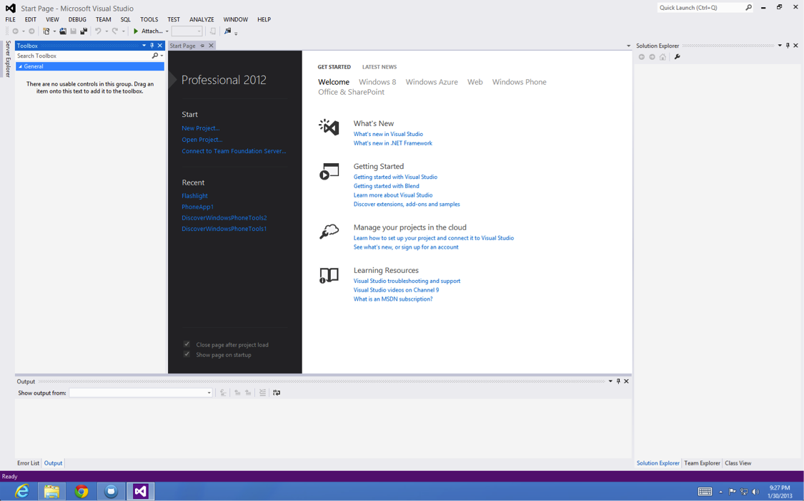
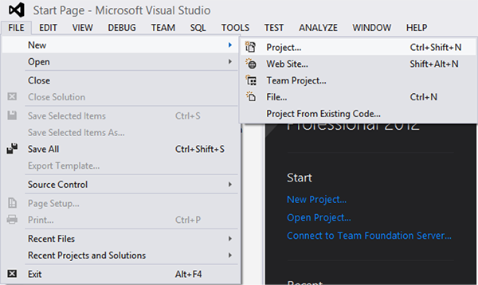
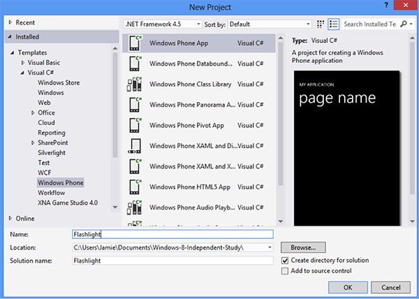
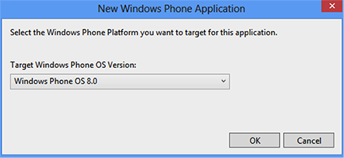
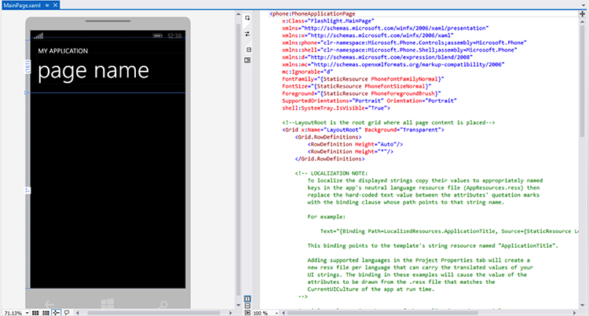
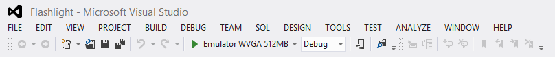
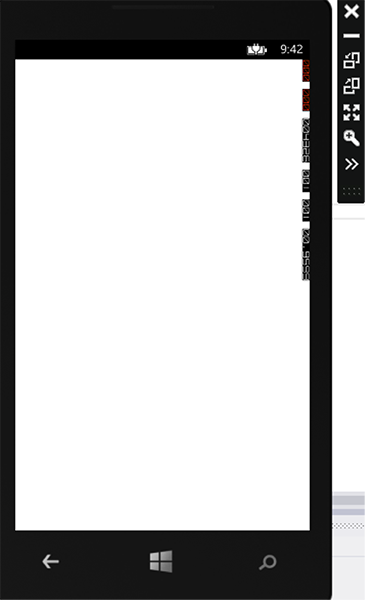

# Flashlight

### Flashlight app will provide a blank white screen allowing the phone to serve as a beacon of light in a dark area.

**Requirements**

* Visual Studio 2012
* Windows Phone 8 SDK
* Windows 8

***

After launching `Visual Studio 2012`, you will be presented with the `Start Page`. It will give you an overview of the projects you have recently been working, links to developer resources as well as developer news from the Windows Development teams.



***

To create a new project you can either select `New Project` from the `Start Page` or navigate the file menu by selecting `File -> New -> Project`.



***

In the `New Project` dialog window, select `Templates -> Visual C# -> Windows Phone` on the left column and `Windows Phone App` in the resulting right column. The name of the app will be `Flashlight` and ensure that `Create directory for solution` is checked.



***

After selecting OK, Visual Studio (VS) will ask you which Windows Phone OS is the target version for this project. In the dropdown menu, leave the default value of `Windows Phone OS 8.0` and proceed while VS creates your first project.



***

You will now see two column panels. The left is the Designer which is a GUI interface that VS allows you to place objets onto the UI. The right side is the code editor which provides a XAML file, a XML-like formatted document which represents the UI. Changes to one panel will affect both panels and VS will automatically refresh the panels with the updated changes.



***

## MainPage.xaml

Let's look at the current source code for the default xaml page that VS generates.

```xml
<phone:PhoneApplicationPage
    x:Class="Flashlight.MainPage"
    xmlns="http://schemas.microsoft.com/winfx/2006/xaml/presentation"
    xmlns:x="http://schemas.microsoft.com/winfx/2006/xaml"
    xmlns:phone="clr-namespace:Microsoft.Phone.Controls;assembly=Microsoft.Phone"
    xmlns:shell="clr-namespace:Microsoft.Phone.Shell;assembly=Microsoft.Phone"
    xmlns:d="http://schemas.microsoft.com/expression/blend/2008"
    xmlns:mc="http://schemas.openxmlformats.org/markup-compatibility/2006"
    mc:Ignorable="d"
    FontFamily="{StaticResource PhoneFontFamilyNormal}"
    FontSize="{StaticResource PhoneFontSizeNormal}"
    Foreground="{StaticResource PhoneForegroundBrush}"
    SupportedOrientations="Portrait" Orientation="Portrait"
    shell:SystemTray.IsVisible="True">

    <!--LayoutRoot is the root grid where all page content is placed-->
    <Grid x:Name="LayoutRoot" Background="Transparent">
        <Grid.RowDefinitions>
            <RowDefinition Height="Auto"/>
            <RowDefinition Height="*"/>
        </Grid.RowDefinitions>

        <!-- LOCALIZATION NOTE:
            To localize the displayed strings copy their values to appropriately named
            keys in the app's neutral language resource file (AppResources.resx) then
            replace the hard-coded text value between the attributes' quotation marks
            with the binding clause whose path points to that string name.

            For example:

                Text="{Binding Path=LocalizedResources.ApplicationTitle, Source={StaticResource LocalizedStrings}}"

            This binding points to the template's string resource named "ApplicationTitle".

            Adding supported languages in the Project Properties tab will create a
            new resx file per language that can carry the translated values of your
            UI strings. The binding in these examples will cause the value of the
            attributes to be drawn from the .resx file that matches the
            CurrentUICulture of the app at run time.
         -->

        <!--TitlePanel contains the name of the application and page title-->
        <StackPanel x:Name="TitlePanel" Grid.Row="0" Margin="12,17,0,28">
            <TextBlock Text="MY APPLICATION" Style="{StaticResource PhoneTextNormalStyle}" Margin="12,0"/>
            <TextBlock Text="page name" Margin="9,-7,0,0" Style="{StaticResource PhoneTextTitle1Style}"/>
        </StackPanel>

        <!--ContentPanel - place additional content here-->
        <Grid x:Name="ContentPanel" Grid.Row="1" Margin="12,0,12,0">

        </Grid>

        <!--Uncomment to see an alignment grid to help ensure your controls are
            aligned on common boundaries.  The image has a top margin of -32px to
            account for the System Tray. Set this to 0 (or remove the margin altogether)
            if the System Tray is hidden.

            Before shipping remove this XAML and the image itself.-->
        <!--<Image Source="/Assets/AlignmentGrid.png" VerticalAlignment="Top" Height="800" Width="480" Margin="0,-32,0,0" Grid.Row="0" Grid.RowSpan="2" IsHitTestVisible="False" />-->
    </Grid>

</phone:PhoneApplicationPage>
```

***

## Breakdown of XAML Elements

There are two main child elements in the <grid> element. 

`StackPanel` is the top half of the application as soon in the Designer preview. There are two text block elements which associate with the default text.

`Grid` is the secondary grid element which serves as the main content area. This is where you would place additional elements or control elements. Is is nested in another Grid element named LayoutRoot and provides a secondary grouping of elements.

```xml
        <!--TitlePanel contains the name of the application and page title-->
        <StackPanel x:Name="TitlePanel" Grid.Row="0" Margin="12,17,0,28">
            <TextBlock Text="MY APPLICATION" Style="{StaticResource PhoneTextNormalStyle}" Margin="12,0"/>
            <TextBlock Text="page name" Margin="9,-7,0,0" Style="{StaticResource PhoneTextTitle1Style}"/>
        </StackPanel>

        <!--ContentPanel - place additional content here-->
        <Grid x:Name="ContentPanel" Grid.Row="1" Margin="12,0,12,0">

        </Grid>
```

We are going to remove both of these elements and see the updated change in the Designer view. You will notice that all the text has been removed and it is previewing a black background.

***

## MainPage.xaml

Now we will look at the remaining `Grid` element tag. It as an attribute reading `Background="Transparent"` and we will simply change that to `Background="White"`. You will notice that the preview background is now previewing that the color has changed to white.

```
    <!--LayoutRoot is the root grid where all page content is placed-->
    <Grid x:Name="LayoutRoot" Background="White">
        <Grid.RowDefinitions>
            <RowDefinition Height="Auto"/>
            <RowDefinition Height="*"/>
        </Grid.RowDefinitions>
    </Grid>
```

***

The final source code for this UI page. Now we can build and run in the Windows Phone Simulator.

```xml
<phone:PhoneApplicationPage
    x:Class="Flashlight.MainPage"
    xmlns="http://schemas.microsoft.com/winfx/2006/xaml/presentation"
    xmlns:x="http://schemas.microsoft.com/winfx/2006/xaml"
    xmlns:phone="clr-namespace:Microsoft.Phone.Controls;assembly=Microsoft.Phone"
    xmlns:shell="clr-namespace:Microsoft.Phone.Shell;assembly=Microsoft.Phone"
    xmlns:d="http://schemas.microsoft.com/expression/blend/2008"
    xmlns:mc="http://schemas.openxmlformats.org/markup-compatibility/2006"
    mc:Ignorable="d"
    FontFamily="{StaticResource PhoneFontFamilyNormal}"
    FontSize="{StaticResource PhoneFontSizeNormal}"
    Foreground="{StaticResource PhoneForegroundBrush}"
    SupportedOrientations="Portrait" Orientation="Portrait"
    shell:SystemTray.IsVisible="True">

    <!--LayoutRoot is the root grid where all page content is placed-->
    <Grid x:Name="LayoutRoot" Background="White">
        <Grid.RowDefinitions>
            <RowDefinition Height="Auto"/>
            <RowDefinition Height="*"/>
        </Grid.RowDefinitions>
    </Grid>
</phone:PhoneApplicationPage>
```

## Build & Deploy

In order to deploy the app within the Windows Phone Simulator, you can use the menu `Debug -> Start Debugging (F5)` or by selecting the green play arrow button on the toolbar shown below. The default settings for the simulator is sufficient for testing our app and is listed as `Emulator WVGA 512MB`.



Now wait while VS builds and then installs the app on the Windows Phone Simulator.

***

## Simulator

Here is a screenshot of the deployed version of the application. You should see a white screen. Congratulations! You have now built your first app for the Windows Phone 8 platform.

