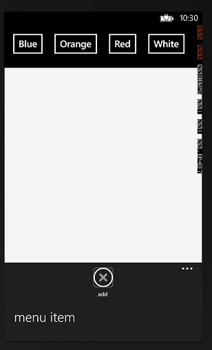
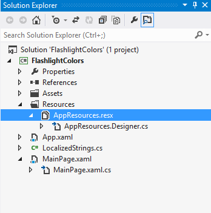
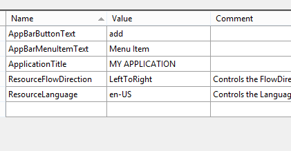
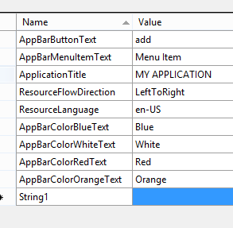
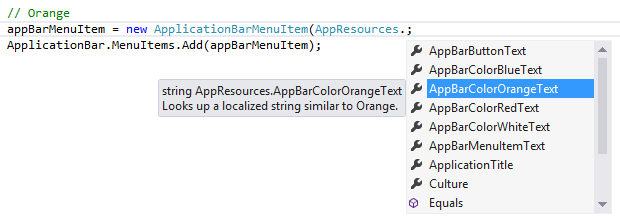
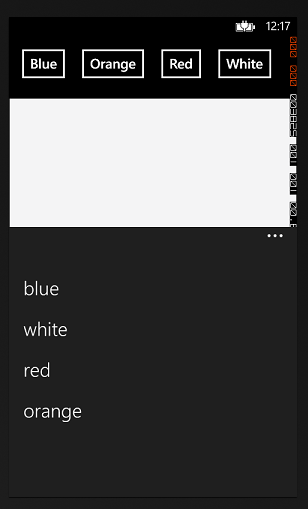
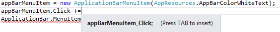
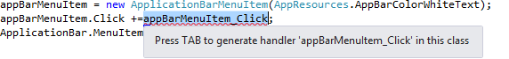

# FlashlightColorsAppBar

### FlashlightColorsAppBar app will provide the user options to change the flashlight color using the built in Application Bar menu.

**Requirements**

* Visual Studio 2012
* Windows Phone 8 SDK
* Windows 8
* FlashlightColors Tutorial

***

This tutorial is a modification of the FlashlightColors tutorial. Using that as our base code, duplicate the source and rename the parent directory containing the Visual Studio solution file to FlashlightColorsAppBar.

You will have a similar directory:

```
FlashlightColorsAppBar
-- FlashlightColors.sln
-- (directory) FlashlightColors
-- + Files from previous FlashlightColors tutorial

```

Open the new duplciated solution file in Visual Studio and run it to ensure that everything still builds.

## Windows Phone Application Bar
The windows Phone 8 Application bar is a row of individual set of buttons that are held within a special menu on the phone screen. The Application Bar is enabled by the use of elipsisis within the application. Developers are encouraged to use the Application Bar to allow more space on the phone screen and also as sub menus for the application.

We will see the default implementation of the Application Bar and the modify it to provide identical functionality of our flashlight. The goal with this side tutorial is to remove the color buttons on the phone page and increase the area of the flashlight. We can place all these color options in a sub menu called the Application Bar.

## Activating the Application Bar
Let us open up the MainPage.xaml.cs file. We will notice the following code that is commented out:

```
        // Constructor
        public MainPage()
        {
            InitializeComponent();

            // Sample code to localize the ApplicationBar
            //BuildLocalizedApplicationBar();
        }
```

And at the bottom of the file we also see the following:

```
        // Sample code for building a localized ApplicationBar
        //private void BuildLocalizedApplicationBar()
        //{
        //    // Set the page's ApplicationBar to a new instance of ApplicationBar.
        //    ApplicationBar = new ApplicationBar();

        //    // Create a new button and set the text value to the localized string from AppResources.
        //    ApplicationBarIconButton appBarButton = new ApplicationBarIconButton(new Uri("/Assets/AppBar/appbar.add.rest.png", UriKind.Relative));
        //    appBarButton.Text = AppResources.AppBarButtonText;
        //    ApplicationBar.Buttons.Add(appBarButton);

        //    // Create a new menu item with the localized string from AppResources.
        //    ApplicationBarMenuItem appBarMenuItem = new ApplicationBarMenuItem(AppResources.AppBarMenuItemText);
        //    ApplicationBar.MenuItems.Add(appBarMenuItem);
        //}

```

We will go ahead and uncomment all the lines. Our MainPage.xaml.cs will look like the following:

```
using System;
using System.Collections.Generic;
using System.Linq;
using System.Net;
using System.Windows;
using System.Windows.Controls;
using System.Windows.Navigation;
using Microsoft.Phone.Controls;
using Microsoft.Phone.Shell;
using FlashlightColors.Resources;
using System.Windows.Media;

namespace FlashlightColors
{
    public partial class MainPage : PhoneApplicationPage
    {
        // Constructor
        public MainPage()
        {
            InitializeComponent();

            // Sample code to localize the ApplicationBar
            BuildLocalizedApplicationBar();
        }

        private void ColorButton_Click(object sender, RoutedEventArgs e)
        {
            var color = Colors.White;
            var button = (Button)sender;

            switch (button.Name)
            {
                case "WhiteButton":
                    color = Colors.White;
                    break;

                case "BlueButton":
                    color = Colors.Blue;
                    break;

                case "RedButton":
                    color = Colors.Red;
                    break;

                case "OrangeButton":
                    color = Colors.Orange;
                    break;
            }

            Flashlight.Fill = new SolidColorBrush(color);
        }

        //Sample code for building a localized ApplicationBar
        private void BuildLocalizedApplicationBar()
        {
            // Set the page's ApplicationBar to a new instance of ApplicationBar.
            ApplicationBar = new ApplicationBar();

            // Create a new button and set the text value to the localized string from AppResources.
            ApplicationBarIconButton appBarButton = new ApplicationBarIconButton(new Uri("/Assets/AppBar/appbar.add.rest.png", UriKind.Relative));
            appBarButton.Text = AppResources.AppBarButtonText;
            ApplicationBar.Buttons.Add(appBarButton);

            // Create a new menu item with the localized string from AppResources.
            ApplicationBarMenuItem appBarMenuItem = new ApplicationBarMenuItem(AppResources.AppBarMenuItemText);
            ApplicationBar.MenuItems.Add(appBarMenuItem);
        }
    }
}
```

Go ahead and built the program and you will notice the elipsis at the bottom right of the screen. This is the application bar and when clicked, a secondary screen is animated from the bottom with one option: "menu item".

The goal for this new modified application is to move the button options from the main screen into the applicatino bar.



## String Resources in Windows 8 Phone Development

Before we break the code apart, we will also look at using String Resources within WP8 Development. Looking at the BuildLocalizedApplicationBar() method, we will see references to a AppResources class. More specifically, we are looking at the static strings AppResources.AppBarButtonText and AppResources.AppBarMenuItemText. These are string references which are used in localization. If we wanted to easily translate our application in different languages, we would use a string resources file which is a key/value dictionary file holding a app friendly name for the string and the human readnable friendly name for the string.

Within the Solution Explorer, click on the AppResources.resx file to launch a new window with the string resources for our current flashlight app.



We see a table list view which holds the Name/Value/Comment for various string resources.



Using String Resources are not only used for language translations but are also important when maintaining your application. As an application grows, it is important to have one centralized location for all the labeled text in your application. Instead of digging through your code to find where the strings are used, it can easily be changed in your application and chnages can be reflected in multiple locations across your application without once changing your code.

While we are open within resources file we will create string values for the supported colors in our application: Blue, White, Red, Orange. This is easily accomplished by pressing the `Add Resource` button.

We will use the naming convention **AppBarColor{{COLOR}}Text** where **{{Color}}** is the type of color for the name of our string resources. Once you have added all four colors, save the AppResources.resx file.



## Building the Application Bar

The next step is to actually build the application bar. We will be taking another look at the `private void BuildLocalizedApplicationBar()` signature method at the bottom of MainPage.xaml.cs.

Reading through the comments, to setup the application bar we instantiate a new ApplicationBar object. Application bars can contain a mixture of image icons and text which represents actions that the user can invoke. For the sake of our applciation we do not need icons but simply a text menu will sufface.

We will get rid of the second block in the middle dealing with the application bar image. The main interest for this block of this code is the following:

```
            // Create a new menu item with the localized string from AppResources.
            ApplicationBarMenuItem appBarMenuItem = new ApplicationBarMenuItem(AppResources.AppBarMenuItemText);
            ApplicationBar.MenuItems.Add(appBarMenuItem);
```                       

What we need to do is create an `ApplicationbarMenuItem` for each of the colors and add it to the `ApplicationBar.MenuItems` collection list.

Here is a sample code of how to accomplish just that:

```
        //Sample code for building a localized ApplicationBar
        private void BuildLocalizedApplicationBar()
        {
            // Set the page's ApplicationBar to a new instance of ApplicationBar.
            ApplicationBar = new ApplicationBar();

            // Create a new menu item with the localized string from AppResources.
            ApplicationBarMenuItem appBarMenuItem;

            // Blue
            appBarMenuItem = new ApplicationBarMenuItem(AppResources.AppBarColorBlueText);
            ApplicationBar.MenuItems.Add(appBarMenuItem);

            // White
            appBarMenuItem = new ApplicationBarMenuItem(AppResources.AppBarColorWhiteText);
            ApplicationBar.MenuItems.Add(appBarMenuItem);

            // Red
            appBarMenuItem = new ApplicationBarMenuItem(AppResources.AppBarColorRedText);
            ApplicationBar.MenuItems.Add(appBarMenuItem);

            // Orange
            appBarMenuItem = new ApplicationBarMenuItem(AppResources.AppBarColorOrangeText);
            ApplicationBar.MenuItems.Add(appBarMenuItem);

        }
```

When calling from the AppResources class, notice that Visual Studio automatically will perform an autocomplete of all the resource strings available. This makes it easy to maintain the literal values of the strings in one centralized area and reuse strings.



Rebuid the app, after you tap the elipsis on the lower right end of the screen you will see the application bar at work with the four color options. 



## Adding Click Events to the Application Bar

Like the previous Flashlight tutorial apps, we used events to change the background color based on an user activated action such as tapping the button. In the same manner, the Application Bar Menu Items respond to events. Further reading into the [ApplicationMenuItem Class](http://msdn.microsoft.com/en-us/library/windowsphone/develop/microsoft.phone.shell.applicationbarmenuitem.aspx) documentation we can see that it has an EventHandler called Click which is invoked when the user clicks on an item within the application bar.

Adding a new click event is easy: as demonstrated below, visual studio will detect that you are trying to create a new event and hint to press TAB to insert the new event and then a second TAB to generate the click event for the menu item.






Visual studio will genenerate the following code by default at the bottom of our new class. Setup the same Click event for the remainder colors. Our code now looks like the following:

```
        //Sample code for building a localized ApplicationBar
        private void BuildLocalizedApplicationBar()
        {
            // Set the page's ApplicationBar to a new instance of ApplicationBar.
            ApplicationBar = new ApplicationBar();

            // Create a new menu item with the localized string from AppResources.
            ApplicationBarMenuItem appBarMenuItem;

            // Blue
            appBarMenuItem = new ApplicationBarMenuItem(AppResources.AppBarColorBlueText);
            appBarMenuItem.Click += appBarMenuItem_Click;
            ApplicationBar.MenuItems.Add(appBarMenuItem);

            // White
            appBarMenuItem = new ApplicationBarMenuItem(AppResources.AppBarColorWhiteText);
            appBarMenuItem.Click += appBarMenuItem_Click;
            ApplicationBar.MenuItems.Add(appBarMenuItem);

            // Red
            appBarMenuItem = new ApplicationBarMenuItem(AppResources.AppBarColorRedText);
            appBarMenuItem.Click += appBarMenuItem_Click;
            ApplicationBar.MenuItems.Add(appBarMenuItem);

            // Orange
            appBarMenuItem = new ApplicationBarMenuItem(AppResources.AppBarColorOrangeText);
            appBarMenuItem.Click += appBarMenuItem_Click;
            ApplicationBar.MenuItems.Add(appBarMenuItem);

        }
        
        void appBarMenuItem_Click(object sender, EventArgs e)
        {
            throw new NotImplementedException();
        }
```

Just like our previous `ColorButton_Click` method that handled the click buttons based on the Button name, we will do a similar approach for the ApplicationBarMenuItem click events. Unfortunately, we can't copy and paste the code from the previous click event because the `Button` class has a `Name` attribute while the `ApplicationMenuBarItem` uses a `Text` attribute. Here's the completed method for `appBarMenuItem_Click`. Compare the differences, run and build the application, then try to change the color by selecting a new color in the application menu bar. Be sure to read the comments in this code block for additoinal notes.

```
        void appBarMenuItem_Click(object sender, EventArgs e)
        {
            var menuItem = (ApplicationBarMenuItem)sender;
            var color = Colors.White;

            // We use the .Text attribute instead of .Name because that is what
            // ApplicationBarMenuItem supports
            switch (menuItem.Text)
            {
                // Notice that we cannot use the AppResources.AppBarColorWhiteText
                // This is because C# requires that switch statements use static constant strings
                // Our strings using AppResources are not static by nature.
                case "White":
                    color = Colors.White;
                    break;

                case "Blue":
                    color = Colors.Blue;
                    break;

                case "Red":
                    color = Colors.Red;
                    break;

                case "Orange":
                    color = Colors.Orange;
                    break;
            }

            Flashlight.Fill = new SolidColorBrush(color);
        }
```

## Removing traces of old code
We are essentially finished with this application but the last step is to refactor and remove old code that we are no longer using. First things first is to remove the old `ColorButton_Click` method. Next is to modify the MainPage.xaml in order to remove the four colored buttons from the user interface. Afterwards, it is simply resizing the rectangle to the full width and height to the screen and rebuilding!


# MainPage.xaml.cs

```
using System;
using System.Collections.Generic;
using System.Linq;
using System.Net;
using System.Windows;
using System.Windows.Controls;
using System.Windows.Navigation;
using Microsoft.Phone.Controls;
using Microsoft.Phone.Shell;
using FlashlightColors.Resources;
using System.Windows.Media;

namespace FlashlightColors
{
    public partial class MainPage : PhoneApplicationPage
    {
        // Constructor
        public MainPage()
        {
            InitializeComponent();

            // Sample code to localize the ApplicationBar
            BuildLocalizedApplicationBar();
        }

        private void ColorButton_Click(object sender, RoutedEventArgs e)
        {
            var color = Colors.White;
            var button = (Button)sender;

            switch (button.Name)
            {
                case "WhiteButton":
                    color = Colors.White;
                    break;

                case "BlueButton":
                    color = Colors.Blue;
                    break;

                case "RedButton":
                    color = Colors.Red;
                    break;

                case "OrangeButton":
                    color = Colors.Orange;
                    break;
            }

            Flashlight.Fill = new SolidColorBrush(color);
        }

        //Sample code for building a localized ApplicationBar
        private void BuildLocalizedApplicationBar()
        {
            // Set the page's ApplicationBar to a new instance of ApplicationBar.
            ApplicationBar = new ApplicationBar();

            // Create a new menu item with the localized string from AppResources.
            ApplicationBarMenuItem appBarMenuItem;

            // Blue
            appBarMenuItem = new ApplicationBarMenuItem(AppResources.AppBarColorBlueText);
            appBarMenuItem.Click += appBarMenuItem_Click;
            ApplicationBar.MenuItems.Add(appBarMenuItem);

            // White
            appBarMenuItem = new ApplicationBarMenuItem(AppResources.AppBarColorWhiteText);
            appBarMenuItem.Click += appBarMenuItem_Click;
            ApplicationBar.MenuItems.Add(appBarMenuItem);

            // Red
            appBarMenuItem = new ApplicationBarMenuItem(AppResources.AppBarColorRedText);
            appBarMenuItem.Click += appBarMenuItem_Click;
            ApplicationBar.MenuItems.Add(appBarMenuItem);

            // Orange
            appBarMenuItem = new ApplicationBarMenuItem(AppResources.AppBarColorOrangeText);
            appBarMenuItem.Click += appBarMenuItem_Click;
            ApplicationBar.MenuItems.Add(appBarMenuItem);

        }

        void appBarMenuItem_Click(object sender, EventArgs e)
        {
            var menuItem = (ApplicationBarMenuItem)sender;
            var color = Colors.White;

            // We use the .Text attribute instead of .Name because that is what
            // ApplicationBarMenuItem supports
            switch (menuItem.Text)
            {
                // Notice that we cannot use the AppResources.AppBarColorWhiteText
                // This is because C# requires that switch statements use static constant strings
                // Our strings using AppResources are not static by nature.
                case "White":
                    color = Colors.White;
                    break;

                case "Blue":
                    color = Colors.Blue;
                    break;

                case "Red":
                    color = Colors.Red;
                    break;

                case "Orange":
                    color = Colors.Orange;
                    break;
            }

            Flashlight.Fill = new SolidColorBrush(color);
        }
    }
}
```

# MainPage.xaml
```
<phone:PhoneApplicationPage
    x:Class="FlashlightColors.MainPage"
    xmlns="http://schemas.microsoft.com/winfx/2006/xaml/presentation"
    xmlns:x="http://schemas.microsoft.com/winfx/2006/xaml"
    xmlns:phone="clr-namespace:Microsoft.Phone.Controls;assembly=Microsoft.Phone"
    xmlns:shell="clr-namespace:Microsoft.Phone.Shell;assembly=Microsoft.Phone"
    xmlns:d="http://schemas.microsoft.com/expression/blend/2008"
    xmlns:mc="http://schemas.openxmlformats.org/markup-compatibility/2006"
    mc:Ignorable="d"
    FontFamily="{StaticResource PhoneFontFamilyNormal}"
    FontSize="{StaticResource PhoneFontSizeNormal}"
    Foreground="{StaticResource PhoneForegroundBrush}"
    SupportedOrientations="Portrait" Orientation="Portrait"
    shell:SystemTray.IsVisible="True">

    <!--LayoutRoot is the root grid where all page content is placed-->
    <Grid x:Name="LayoutRoot" Background="Transparent">
        <Grid.RowDefinitions>
            <RowDefinition Height="Auto"/>
            <RowDefinition Height="*"/>
        </Grid.RowDefinitions>

        <!-- LOCALIZATION NOTE:
            To localize the displayed strings copy their values to appropriately named
            keys in the app's neutral language resource file (AppResources.resx) then
            replace the hard-coded text value between the attributes' quotation marks
            with the binding clause whose path points to that string name.

            For example:

                Text="{Binding Path=LocalizedResources.ApplicationTitle, Source={StaticResource LocalizedStrings}}"

            This binding points to the template's string resource named "ApplicationTitle".

            Adding supported languages in the Project Properties tab will create a
            new resx file per language that can carry the translated values of your
            UI strings. The binding in these examples will cause the value of the
            attributes to be drawn from the .resx file that matches the
            CurrentUICulture of the app at run time.
         -->

        <!--TitlePanel contains the name of the application and page title-->


        <!--ContentPanel - place additional content here-->
        <Rectangle x:Name="Flashlight" Fill="#FFF4F4F5" Stroke="Black" VerticalAlignment="Top" Height="758" Margin="0,10,0,0" Grid.RowSpan="2"/>

        <!--Uncomment to see an alignment grid to help ensure your controls are
            aligned on common boundaries.  The image has a top margin of -32px to
            account for the System Tray. Set this to 0 (or remove the margin altogether)
            if the System Tray is hidden.

            Before shipping remove this XAML and the image itself.-->
        <!--<Image Source="/Assets/AlignmentGrid.png" VerticalAlignment="Top" Height="800" Width="480" Margin="0,-32,0,0" Grid.Row="0" Grid.RowSpan="2" IsHitTestVisible="False" />-->
    </Grid>

</phone:PhoneApplicationPage>
```
