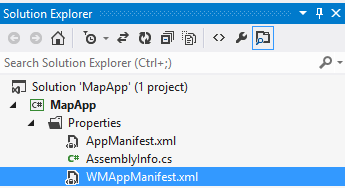
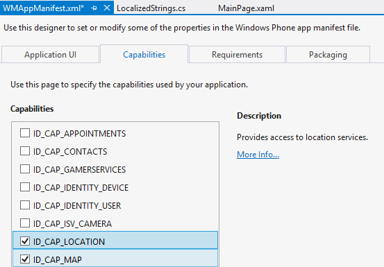
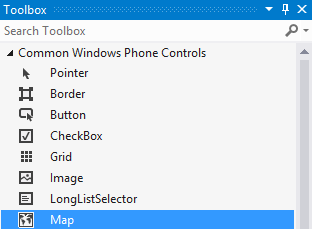
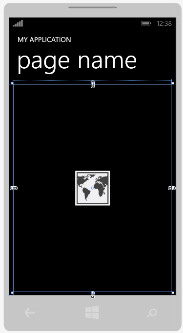
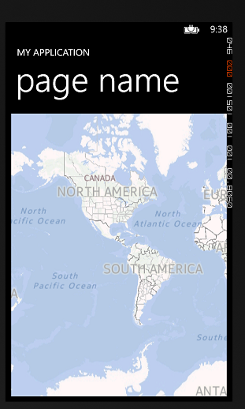
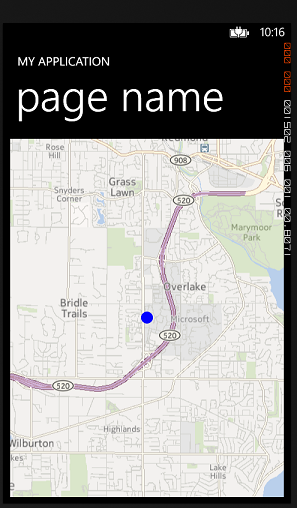

# MapApp Tutorial

In this tutorial we will be learning how to display a map on the phone UI. We will also learn to place overlays on the maps for different GPS coordinates for points of interest. We will also learn how to toggle the various map views such as satellite, aerial and hybrid in a map control.

## Setting up the project

First things first, setup a new project in Visual Studio, this one will still be a `Windows Phone OS 8.0` and the project name can be `MapApp`.

Inside the Solution Explorer, select the `WMAppManifest.xml` file and open it in the editor. Manifest files are used in Windows 8 development to tell the Windows Store what capabilities and requirements a specific app may have. It also holds generic information such as the app icon, various app icon sizes and tile information.



Within the editor, click the `Capabilities` tab. Thinking about our Map Application, it is pretty easy to determine which capabilities will be required: Eneusr ethat **ID_CAP_LOCATION** and **ID_CAP_MAP** are both selected.

* ID_CAP_LOCATION - provides access to location services (such as GPS)
* ID_CAP_MAP - provides access to mapping functionality (Bing Maps API to draw vector and satellite imagery) 



## Designing the Map Control

Next step is to open our Designer view by clicking `MainPage.xaml`. From the `Toolbox`, drag the `Map` controller onto the Map view.



Use the Designer view to resize the map element so that it takes up the entire portion (width and height) of the ContentPanel.



In the `Properties` pane, give the map a name, I used `MapView`. This will allow us to reference it within our C# classes.

The resulting XAML code to represent the Map control object is as followed:

```xml
        <!--ContentPanel - place additional content here-->
        <Grid x:Name="ContentPanel" Grid.Row="1" Margin="12,0,12,0">
            <maps:Map x:Name="MapView" HorizontalAlignment="Left" VerticalAlignment="Top" Height="597" Width="456"/>
        </Grid>

```

Build the application, you will get a very basic view like the one below:



## Understanding Geocoordinate vs. GeoCoordinate

There are two different classes which are within the Windows Phone 8 SDK. 

* [**Windows.Devices.Geolocation.Geocoordinate**](http://msdn.microsoft.com/en-us/library/windowsphone/develop/windows.devices.geolocation.geocoordinate.aspx) -- object returned by the device when requesting the device location. *"Contains latitude and longitude data for a geographic location."*
* [**System.Device.Location.GeoCoordinate**](http://msdn.microsoft.com/en-us/library/windowsphone/develop/system.device.location.geocoordinate.aspx) -- object that is used within the Map SDK that contains additional layered data. *"Represents a location expressed as a geographic coordinate. The values exposed by this class use the WGS 84 standard."*

We need to create a helper class which converts Geocoordinate to GeoCordinate in order for our mapping API to properly function.

Within the Solution Explorer, right click the project and select Add -> Add New Item. The type of item is Visual C# Class and you can name it `CoordinateConverter.cs`.

Erase the contents of the class and use the following static class and method:

### CoordinateConverter.cs

```csharp
using System;
using System.Device.Location; // Provides the GeoCoordinate class.
using Windows.Devices.Geolocation; //Provides the Geocoordinate class.

namespace MapApp
{
    public static class CoordinateConverter
    {
        public static GeoCoordinate ConvertGeocoordinate(Geocoordinate geocoordinate)
        {
            return new GeoCoordinate
                (
                geocoordinate.Latitude,
                geocoordinate.Longitude,
                geocoordinate.Altitude ?? Double.NaN,
                geocoordinate.Accuracy,
                geocoordinate.AltitudeAccuracy ?? Double.NaN,
                geocoordinate.Speed ?? Double.NaN,
                geocoordinate.Heading ?? Double.NaN
                );
        }
    }
}
```

This is a static class within the `MapApp` namespace which is the name of our app. There is one static class that accepts a `Geocoordinate` object and simply returns a `GeoCoordinate` object using the constructor.

## Showing Device Location on Map

In MainPage.xaml.cs, ensure that the following imports are used. Imports are used to resolve class names and objects that are used within a class.

```csharp
using Microsoft.Phone.Maps.Controls;
using System.Device.Location; // Provides the GeoCoordinate class.
using Windows.Devices.Geolocation; //Provides the Geocoordinate class.
using System.Windows.Media;
using System.Windows.Shapes;
```

We will also create the next empty method which will handle the querying and drawing of the device location onto the map. Notice that we call `ShowDeviceLocation` in the constructor of MainPage so that it starts querying and drawing immediately.

```csharp
        // Constructor
        public MainPage()
        {
            InitializeComponent();

            // Sample code to localize the ApplicationBar
            //BuildLocalizedApplicationBar();

            ShowDeviceLocation();
        }

        private async void ShowDeviceLocation()
        {

        }
```        

### Get Device Location

The first part of the app is to show the device location on the map. To do this we will need to query the device location, convert the given coordinate to the proper object that the Map control will use. 

Inside the `ShowDeviceLocation` method, all the following code:

```csharp
            // Get current location from device
            Geolocator deviceLocator = new Geolocator();
            
            // Sends an asynchronous request to get the device location
            Geoposition devicePosition = await deviceLocator.GetGeopositionAsync();

            // Converts the Geocoordinate from the device position to a GeoCoordinate
            // Uses the helper class we just created: CoordinateConverter
            GeoCoordinate deviceCoordinate = CoordinateConverter.ConvertGeocoordinate(devicePosition.Coordinate);
```

### Understanding Maps

The easiest way to understand how maps work is to think of the Map as one gigantic canvas. In order for developers to draw on the canvas that the Bing Maps API provides, they must use layers, which are transparent canvases with annotations that can be placed on top of each other on top of the base map canvas.

In order for us to annotate our map, we must create a shape, add it to a new map layer, then add that layer to the map on top as an annotation.

### Display Device Location

Now that there is an understanding of maps, the complete stub for `ShowDeviceLocation`:

```csharp
        private async void ShowDeviceLocation()
        {
            // Get current location from device
            Geolocator deviceLocator = new Geolocator();
            
            // Sends an asynchronous request to get the device location
            Geoposition devicePosition = await deviceLocator.GetGeopositionAsync();

            // Converts the Geocoordinate from the device position to a GeoCoordinate
            // Uses the helper class we just created: CoordinateConverter
            GeoCoordinate deviceCoordinate = CoordinateConverter.ConvertGeocoordinate(devicePosition.Coordinate);

            // Create a small circle to mark the current location.
            Ellipse myCircle = new Ellipse();
            myCircle.Fill = new SolidColorBrush(Colors.Blue);
            myCircle.Height = 20;
            myCircle.Width = 20;
            myCircle.Opacity = 50;

            // Create a MapOverlay to contain the circle.
            MapOverlay myLocationOverlay = new MapOverlay();
            myLocationOverlay.Content = myCircle;
            myLocationOverlay.PositionOrigin = new Point(0.5, 0.5);
            myLocationOverlay.GeoCoordinate = deviceCoordinate;

            // Create a MapLayer to contain the MapOverlay.
            MapLayer myLocationLayer = new MapLayer();
            myLocationLayer.Add(myLocationOverlay);

            // Add the MapLayer to the Map.
            MapView.Layers.Add(myLocationLayer);

            // Center the map and zoom in to map level 13 
            MapView.Center = deviceCoordinate;
            MapView.ZoomLevel = 13;
        }

```

Run and build the application, you should have a view similar to below:



The reason why you won't see your actual location is that the developer SDK version of the simulator always uses Redmond as the default GPS Location. If you wanted to use an actual GPS location, you would need to deploy on an actual Windows Phone 8 device.

## Changing Map View
Next we will add an application bar to demonstrate the various map views provided in the SDK: Aerial view which provides satellite imagery and Road view which is the default vectorized map with streets, buildings and geospaces. In the application bar, we will also add options to zoom in and zoom out.

Recalling from previous tutorials, edit the AppResources.resx file to add the string localization values.

- **AppBar_ZoomIn** "Zoom In"
- **AppBar_ZoomOut** "Zoom Out"
- **AppBar_AerialView** "Aerial View"
- **AppBar_RoadView** "Road View"

Recalling from previous tutorials, uncomment the `BuildLocalizedApplicationBar();` method inside the `MainPage` constructor. Clear your `BuildLocalizedApplicationBar` method and use the following code:

```csharp

		// Sample code for building a localized ApplicationBar
        private void BuildLocalizedApplicationBar()
        {
            // Set the page's ApplicationBar to a new instance of ApplicationBar.
            ApplicationBar = new ApplicationBar();

            // Create a new menu item with the localized string from AppResources.
            ApplicationBarMenuItem appBarMenuItem;

            appBarMenuItem = new ApplicationBarMenuItem(AppResources.AppBar_ZoomIn);
            appBarMenuItem.Click += ZoomIn_click;
            ApplicationBar.MenuItems.Add(appBarMenuItem);

            appBarMenuItem = new ApplicationBarMenuItem(AppResources.AppBar_ZoomOut);
            appBarMenuItem.Click += ZoomOut_click;
            ApplicationBar.MenuItems.Add(appBarMenuItem);

            appBarMenuItem = new ApplicationBarMenuItem(AppResources.AppBar_AerialView);
            appBarMenuItem.Click += AerialView_click;
            ApplicationBar.MenuItems.Add(appBarMenuItem);

            appBarMenuItem = new ApplicationBarMenuItem(AppResources.AppBar_RoadView);
            appBarMenuItem.Click += RoadView_click;
            ApplicationBar.MenuItems.Add(appBarMenuItem);
        }

        void ZoomIn_click(object sender, EventArgs e)
        {
            throw new NotImplementedException();
        }

        void ZoomOut_click(object sender, EventArgs e)
        {
            throw new NotImplementedException();
        }

        void AerialView_click(object sender, EventArgs e)
        {
            throw new NotImplementedException();
        }
        
        void RoadView_click(object sender, EventArgs e)
        {
            throw new NotImplementedException();
        }
        

```


You will notice that we have four additional method stubs that are not yet implemented. We are going to setup separate event handlers for the various application bar items.

### Implementing Map Zoom Levels (ZoomIn + ZoomOut)
The user can normally pinch in and pinch out on the device in order to zoom and zoom out respectively. Sometimes in your application you may need to specific a specific zoom level to get the amount of detail you need on the map. In other cases, it may be necessary to explicitly specify these zoom controls depending on the target audience of your application.

From the code below, you can see that there is a field within every Map controller called `ZoomLevel` which is the current level of zoom the map is using to display. This value is easy to change using the instantiated objected and can be set to a new value for the zoom to adjust its viewing region.

```csharp
        void ZoomIn_click(object sender, EventArgs e)
        {
            double zoom;
            zoom = MapView.ZoomLevel;
            MapView.ZoomLevel = ++zoom;
        }

        void ZoomOut_click(object sender, EventArgs e)
        {
            double zoom;
            zoom = MapView.ZoomLevel;
            MapView.ZoomLevel = --zoom;
        }

```

### Implementing Map Cartographic Modes (Aerial + RoadView)
In addition, the maps within the Bing Maps SDK provide multiple views which are easily manipulating through field objects within the Map class.

- Road: this is the normal 2-D map which is used as default

- Aerial: Also known as satellite view, this provides the aerial photographic view of the maps

- Hybrid: this is an aerial map overlay with roads and labels from the Road mode

- Terrain: displays elevation, water spaces and other geographical features such as mountains and rivers


From the code below, you will see that there is a `CartographicMode` field which is the currently set drawing mode of the map. When developing applications it is important to know that the Road map will always be the fastest for the user to render because of the small sizes of the tiles to download from the web services. Aerial + Hybrid + Terrain can be more resource intensive when used in addition with more advanced Map controls.


```csharp
        void AerialView_click(object sender, EventArgs e)
        {
            MapView.CartographicMode = MapCartographicMode.Aerial;
        }

        void RoadView_click(object sender, EventArgs e)
        {
            MapView.CartographicMode = MapCartographicMode.Road;
        }
```        

Finally, build the application again and test that the implemented click event handlers have been working successfully!

## MainPage.xaml.cs